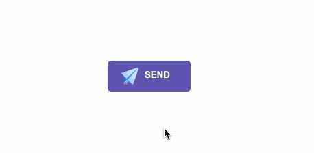
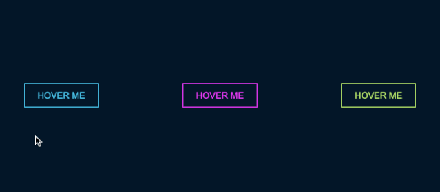
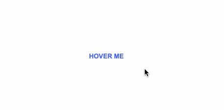
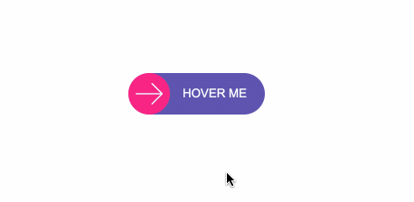
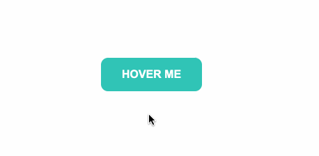
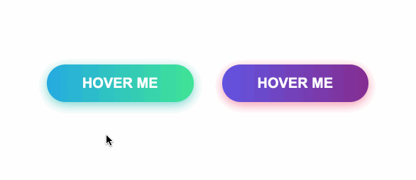
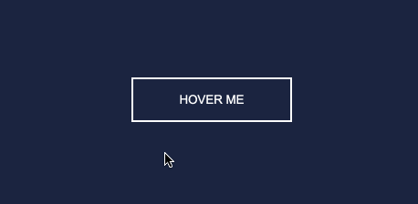
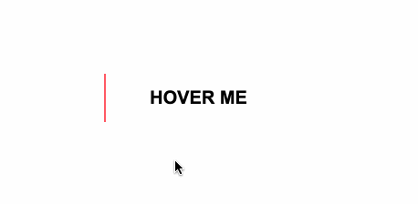

# 发送效果

```html
<div id="send-btn">
  <button>
    // 这里是一个svg的占位
    Send
  </button>
</div>
```

```css
#send-btn{
  display: flex;
  align-items: center;
  justify-content: center;
  height: 100vh;
}

button {
  background: #5f55af;
  border: 0;
  border-radius: 5px;
  padding: 10px 30px 10px 20px;
  color: white;
  text-transform: uppercase;
  font-weight: bold;
}

button svg {
  display: inline-block;
  vertical-align: middle;
  padding-right: 5px;
}

button:hover svg {
  animation: fly 2s ease 1;
}

@keyframes fly {
  0% {
    transform: translateX(0%);
  }

  50% {
    transform: translateX(300%);
  }

  100% {
    transform: translateX(0);
  }
}
```




# 霓虹效果

```html
<div id="neon-btn">
  <button class="btn one">Hover me</button>
  <button  class="btn two">Hover me</button>
  <button  class="btn three">Hover me</button>
</div>
```

```css
#neon-btn {
  display: flex;
  align-items: center;
  justify-content: space-around;
  height: 100vh;
  background: #031628;
}

.btn {
  border: 1px solid;
  background-color: transparent;
  text-transform: uppercase;
  font-size: 14px;
  padding: 10px 20px;
  font-weight: 300;
}

.one {
  color: #4cc9f0;
}

.two {
  color: #f038ff;
}

.three {
  color: #b9e769;
}

.btn:hover {
  color: white;
  border: 0;
}

.one:hover {
  background-color: #4cc9f0;
  -webkit-box-shadow: 10px 10px 99px 6px rgba(76,201,240,1);
  -moz-box-shadow: 10px 10px 99px 6px rgba(76,201,240,1);
  box-shadow: 10px 10px 99px 6px rgba(76,201,240,1);
}

.two:hover {
  background-color: #f038ff;
  -webkit-box-shadow: 10px 10px 99px 6px rgba(240, 56, 255, 1);
  -moz-box-shadow: 10px 10px 99px 6px rgba(240, 56, 255, 1);
  box-shadow: 10px 10px 99px 6px rgba(240, 56, 255, 1);
}

.three:hover {
  background-color: #b9e769;
  -webkit-box-shadow: 10px 10px 99px 6px rgba(185, 231, 105, 1);
  -moz-box-shadow: 10px 10px 99px 6px rgba(185, 231, 105, 1);
  box-shadow: 10px 10px 99px 6px rgba(185, 231, 105, 1);
}
```




# 边框效果

```html
<div id="draw-border">
  <button>Hover me</button>
</div>
```

```css
#draw-border {
  display: flex;
  align-items: center;
  justify-content: center;
  height: 100vh;
}

button {
  border: 0;
  background: none;
  text-transform: uppercase;
  color: #4361ee;
  font-weight: bold;
  position: relative;
  outline: none;
  padding: 10px 20px;
  box-sizing: border-box;
}

button::before, button::after {
  box-sizing: inherit;
  position: absolute;
  content: '';
  border: 2px solid transparent;
  width: 0;
  height: 0;
}

button::after {
  bottom: 0;
  right: 0;
}

button::before {
  top: 0;
  left: 0;
}

button:hover::before, button:hover::after {
  width: 100%;
  height: 100%;
}

button:hover::before {
  border-top-color: #4361ee;
  border-right-color: #4361ee;
  transition: width 0.3s ease-out, height 0.3s ease-out 0.3s;
}

button:hover::after {
  border-bottom-color: #4361ee;
  border-left-color: #4361ee;
  transition: border-color 0s ease-out 0.6s, width 0.3s ease-out 0.6s, height 0.3s ease-out 1s;
}
```




# 圆形效果

```html
<div id="circle-btn">
  <div class="btn-container">
    // 这里有一个svg元素
    <button>Hover me</button>
  </div>
</div>
```

```css
#circle-btn {
  display: flex;
  align-items: center;
  justify-content: center;
  height: 100vh;
}

.btn-container {
  position: relative;
}

button {
  border: 0;
  border-radius: 50px;
  color: white;
  background: #5f55af;
  padding: 15px 20px 16px 60px;
  text-transform: uppercase;
  background: linear-gradient(to right, #f72585 50%, #5f55af 50%);
  background-size: 200% 100%;
  background-position: right bottom;
  transition:all 2s ease;
}

svg {
  background: #f72585;
  padding: 8px;
  border-radius: 50%;
  position: absolute;
  left: 0;
  top: 0%;
}

button:hover {
   background-position: left bottom;
}
```




# 圆角效果

```html
<div id="border-btn">
  <button>Hover me</button>
</div>
```

```css
#border-btn {
  display: flex;
  align-items: center;
  justify-content: center;
  height: 100vh;
}

button {
  border: 0;
  border-radius: 10px;
  background: #2ec4b6;
  text-transform: uppercase;
  color: white;
  font-size: 16px;
  font-weight: bold;
  padding: 15px 30px;
  outline: none;
  position: relative;
  transition: border-radius 3s;
  -webkit-transition: border-radius 3s;
}

button:hover {
   border-bottom-right-radius: 50px;
   border-top-left-radius: 50px;
   border-bottom-left-radius: 10px;
   border-top-right-radius: 10px;
}
```



# 冰冻效果

```html
<div id="frozen-btn">
  <button class="green">Hover me</button>
  <button class="purple">Hover me</button>
</div>
```

```css
#frozen-btn {
  display: flex;
  align-items: center;
  justify-content: center;
  height: 100vh;
}

button {
  border: 0;
  margin: 20px;
  text-transform: uppercase;
  font-size: 20px;
  font-weight: bold;
  padding: 15px 50px;
  border-radius: 50px;
  color: white;
  outline: none;
  position: relative;
}

button:before{
  content: '';
  display: block;
  background: linear-gradient(to left, rgba(255, 255, 255, 0) 50%, rgba(255, 255, 255, 0.4) 50%);
  background-size: 210% 100%;
  background-position: right bottom;
  height: 100%;
  width: 100%;
  position: absolute;
  top: 0;
  bottom:0;
  right:0;
  left: 0;
  border-radius: 50px;
  transition: all 1s;
  -webkit-transition: all 1s;
}

.green {
   background-image: linear-gradient(to right, #25aae1, #40e495);
   box-shadow: 0 4px 15px 0 rgba(49, 196, 190, 0.75);
}

.purple {
   background-image: linear-gradient(to right, #6253e1, #852D91);
   box-shadow: 0 4px 15px 0 rgba(236, 116, 149, 0.75);
}

.purple:hover:before {
  background-position: left bottom;
}

.green:hover:before {
  background-position: left bottom;
}
```



# 闪亮效果

```html
<div id="shiny-shadow">
  <button><span>Hover me</span></button>
</div>
```

```css
#shiny-shadow {
  display: flex;
  align-items: center;
  justify-content: center;
  height: 100vh;
  background: #1c2541;
}

button {
  border: 2px solid white;
  background: transparent;
  text-transform: uppercase;
  color: white;
  padding: 15px 50px;
  outline: none;
  overflow: hidden;
  position: relative;
}

span {
  z-index: 20;
}

button:after {
  content: '';
    display: block;
    position: absolute;
    top: -36px;
    left: -100px;
    background: white;
    width: 50px;
    height: 125px;
    opacity: 20%;
    transform: rotate(-45deg);
}

button:hover:after {
  left: 120%;
  transition: all 600ms cubic-bezier(0.3, 1, 0.2, 1);
   -webkit-transition: all 600ms cubic-bezier(0.3, 1, 0.2, 1);
}

```




# 加载效果总结

```html
<div id="loading-btn">
  <button><span>Hover me</span></button>
</div>
```

```css
#loading-btn {
  display: flex;
  align-items: center;
  justify-content: center;
  height: 100vh;
}

button {
  background: transparent;
  border: 0;
  border-radius: 0;
  text-transform: uppercase;
  font-weight: bold;
  font-size: 20px;
  padding: 15px 50px;
  position: relative;
}

button:before {
  transition: all 0.8s cubic-bezier(0.7, -0.5, 0.2, 2);
  content: '';
  width: 1%;
  height: 100%;
  background: #ff5964;
  position: absolute;
  top: 0;
  left: 0;
}

button span {
  mix-blend-mode: darken;
}

button:hover:before {
  background: #ff5964;
  width: 100%;
}
```

