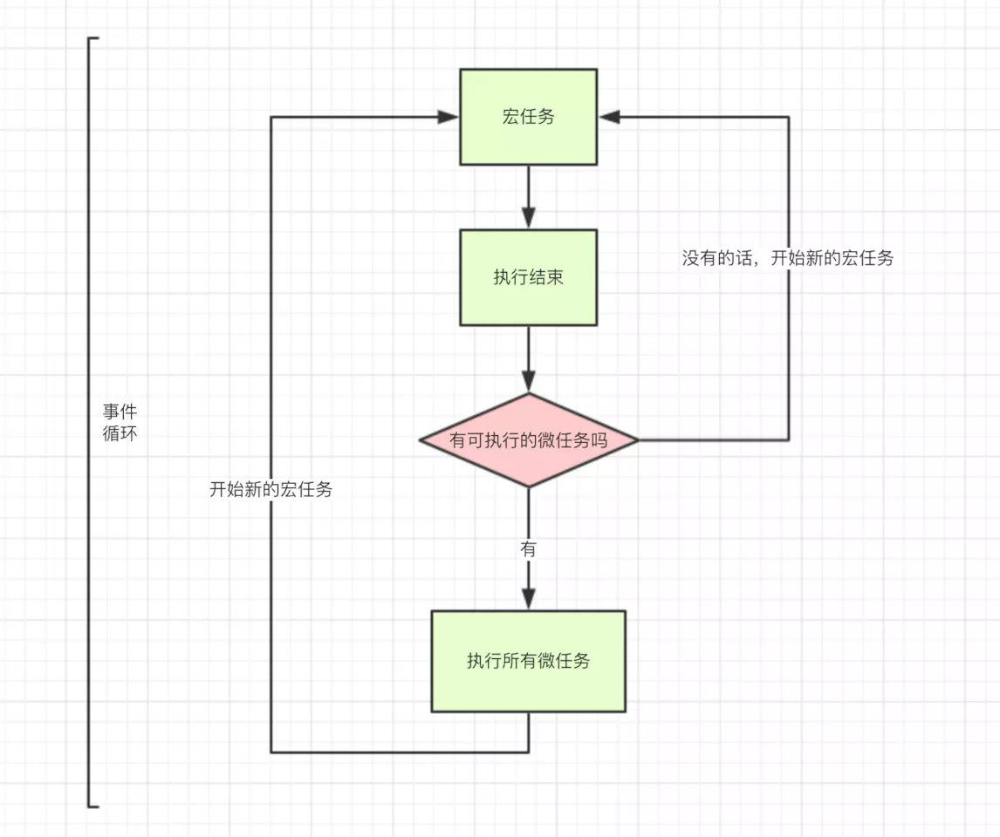

# JS表达式创建顺序和赋值顺序


```javascript
   var a = { n: 1};
   var b = a;
   a.x = a = { n: 2 };//方式1
   //a = a.x = { n: 2 };//方式2
   console.log(a.x);//undefined
   console.log(b.x);//{n:2}
```

   之所以a.x为undefined，是由于赋值表达式里面需要用到的变量都会先创建（如果事先没有的话）并指向null，此处a={n:2}还没开始赋值的时候就已经创建了a.x了，赋值之后a就变了，a.x不存在，因此为undefined

   JS表达式，严格按照从左到右计算，先计算所有变量，再进行赋值过程，如上题

   ```javascript
   a.x=         //此处获得了a.x的表达式结果，此时a={n:1}
       a=       //此时a为当前环境的变量，仍然a={n:1}
         {n:2}  //此时发生了赋值，变量a的值被覆盖，此时a={n:2}
   
   //此时原始的a，即上面的b为
   b；  //{x:{n:2},n:1};
   ```

   复现代码：

   ```javascript
   // 声明“原始的变量 a”
   var a = {n:1};
   
   // 使它的属性表冻结（不能再添加属性）
   Object.freeze(a);
   
   try {
     // 本节的示例代码
     a.x = a = {n:2};
   }
   catch (x) {
     // 异常发生，说明第二次赋值“a.x = ...”中操作的`a`正是原始的变量 a
     console.log('第二次赋值导致异常.');
   }
   
   // 第一次赋值是成功的
   console.log(a.n); //
   
   ```

   # for中let与var

from [[for循环中let与var的区别，块级作用域如何产生与迭代中变量i如何记忆上一步的猜想](https://www.cnblogs.com/echolun/p/10584703.html)]

常规问题：

```javascript
//使用var声明，得到3个3
var a = [];
for (var i = 0; i < 3; i++) {
  a[i] = function () {
    console.log(i);
  };
}
a[0](); //3
a[1](); //3
a[2](); //3
//使用let声明，得到0,1,2
var a = [];
for (let i = 0; i < 3; i++) {
  a[i] = function () {
    console.log(i);
  };
}
a[0](); //0
a[1](); //1
a[2](); //2
```

for循环执行顺序：

1. 设置循环变量
2. 判断循环变量是否符合要求
3. 满足则执行循环体
4. 循环变量自增


改写后var声明逻辑理解：

```javascript
{
  //我是父作用域
  let i = 0;
  if (0 < 3) {
    a[0] = function () {
      //我是子作用域
      console.log(i);
    };
  };
  i++; //为1
  if (1 < 3) {
    a[1] = function () {
      console.log(i);
    };
  };
  i++; //为2
  if (2 < 3) {
    a[2] = function () {
      console.log(i);
    };
  };
  i++; //为3
  // 跳出循环
}
//调用N次指向都是最终的3
a[0](); //3
a[1](); //3
a[2](); //3

```

改写后let声明逻辑理解：

由于let产生了块级作用域，因此每次迭代中的i都是独立存在的

ES6中说明，js引擎会在底层记住上一次循环后的i并赋值给新的一轮循环i

```javascript
var a = []; 
{
    //我是父作用域
    let i = 0;
    if (i < 3) {
        //这一步模拟底层实现
        let k = i;
        a[k] = function () {
            //我是子作用域
            console.log(k);
        };
    };
    i++; //为1
    if (i < 3) {
        let k = i;
        a[k] = function () {
            console.log(k);
        };
    };
    i++; //为2
    if (i < 3) {
        let k = i;
        a[k] = function () {
            console.log(k);
        };
    };
    i++; //为3
    // 跳出循环
}
a[0](); //0
a[1](); //1
a[2](); //2
```


加入引用数据概念后：

```javascript
var a = []
for (let y = {i: 0}; y.i < 3; y.i++) {
    a[y.i] = function () {
        console.log(y.i);
    };
};
a[0](); //3
a[1](); //3
a[2](); //3
```

此处的y绑定的是一个引用对象的地址，虽然每次循环会建立一个新的块级作用域，但他们指向的仍然是同一个引用地址

```javascript
var a = []; {
    //我是父作用域
    let y = {
        i: 0
    };
    if (y.i < 3) {
        //这一步模拟底层实现
        let k = y;
        a[k.i] = function () {
            //我是子作用域
            console.log(k.i);
        };
    };
    y.i++; //为1
    if (y.i < 3) {
        let k = y;
        a[k.i] = function () {
            console.log(k.i);
        };
    };
    y.i++; //为2
    if (y.i < 3) {
        let k = y;
        a[k.i] = function () {
            console.log(k.i);
        };
    };
    y.i++; //为3
    // 跳出循环
}
a[0](); //3
a[1](); //3
a[2](); //3
```


```javascript
var a = []
var b = {i:0};
for (let y = b.i; y < 3; y++) {
    a[y] = function () {
        console.log(y);
    };
};
a[0]();  //0
a[1]();  //1
a[2]();  //2
```


# this绑定优先级

显式绑定 > 隐式绑定 > 默认绑定

new绑定 > 隐式绑定 > 默认绑定

显式绑定和new绑定同时书写会直接报错


+ 默认绑定

  函数调用时无任何调用前缀，指向全局对象

  严格模式下指向undefined

+ 隐式绑定

  函数调用时，前面有调用它的对象，则this绑定在对象上

+ 显示绑定

  通过call、apply、bind方法改变this

+ new绑定

  new实例

```javascript
//显示>隐式
let obj = {
    name:'行星飞行',
    fn:function () {
        console.log(this.name);
    }
};
obj1 = {
    name:'时间跳跃'
};
obj.fn.call(obj1);// 时间跳跃
```

```javascript
//new>隐式
obj = {
    name: '时间跳跃',
    fn: function () {
        this.name = '听风是风';
    }
};
let echo = new obj.fn();
echo.name;//听风是风
```


# 函数中的实参形参局部变量

若实参为基本数据类型，传入函数的实际是实参的副本，存储在函数中的变量组中，因此在函数中修改实参值不会影响函数外的值

若实参为复杂数据类型，传入函数的是地址，因此函数中修改实参会直接修改地址信息


由于通过var重复声明的变量，会被忽略，因此在函数中若有声明实参，声明过程会被忽略

```javascript
var a=1;
(function A(a){
    console.log(a); //1
    var a=2;
    console.log(a);//2
})(a);
console.log(a); //1
```

```javascript
var a=1;
(function A(){
    console.log(a); //undefined
    var a=2;
    console.log(a);//2
})(a);
console.log(a); //1
```


# 只有函数对象有prototype属性

```javascript
function Foo(){};
var foo = new Foo();
```

foo是一个实例对象，但不是一个函数，因此没有prototype

Function，Object，Array，RegExp都是函数

所有对象都会有`__proto__`属性，指向构造函数的prototype

原型链就是根据`__proto__`属性往上的过程，查找对象属性方法时，对象没有，就到`constructor`去找，没有就到`__proto__`去找，再没有就到`__proto__.constructor`去找


而`Object.create()`则是创建一个新对象，用参数对象作为新对象的`__proto__`


# 宏任务和微任务

异步任务的两种




例子：

```javascript
//同步任务
console.log(1);
//宏任务
setTimeout(()=>{
    console.log(2);
},0);
//微任务
Promise.resolve(3).then(b=>{
    console.log(b);
});

//  1 3 2
```

## 宏任务（macrotask queue）

| #                     | 浏览器 | Node |
| --------------------- | ------ | ---- |
| setTimeout            | √      | √    |
| setInterval           | √      | √    |
| setImmediate          | x      | √    |
| requestAnimationFrame | √      | x    |

## 微任务（microtask queue）

| #                          | 浏览器 | Node |
| -------------------------- | ------ | ---- |
| process.nextTick           | x      | √    |
| MutationObserver           | √      | x    |
| Promise.then catch finally | √      | √    |
| Object.observe             | √      | √    |

## 例子

```javascript
//主线程直接执行
console.log('1');
//丢到宏事件队列中
setTimeout(function() {
    console.log('2');
    /**
    node.js下执行的
    process.nextTick(function() {
        console.log('3');
    }) 
    **/
    new Promise(function(resolve) {
        console.log('4');
        resolve();
    }).then(function() {
        console.log('5')
    })
})
//微事件1
/**
node.js下执行的
process.nextTick(function() {
    console.log('6');
})
**/
//主线程直接执行
new Promise(function(resolve) {
    console.log('7');
    resolve();
}).then(function() {
    //微事件2
    console.log('8')
})
//丢到宏事件队列中
setTimeout(function() {
    console.log('9');
    /**
    node.js下执行的
    process.nextTick(function() {
        console.log('10');
    })
    **/
    new Promise(function(resolve) {
        console.log('11');
        resolve();
    }).then(function() {
        console.log('12')
    })
})
```

首先浏览器执行js进入第一个宏任务进入主线程, 直接打印console.log('1')

+ 遇到 **setTimeout**  分发到宏任务Event Queue中
+ 遇到 process.nextTick 丢到微任务Event Queue中
+ 遇到 Promise， new Promise 直接执行 输出 console.log('7');
+ 执行then 被分发到微任务Event Queue中``
+ 第一轮宏任务执行结束，开始执行微任务 打印 6,8
+ 第一轮微任务执行完毕，执行第二轮宏事件，执行setTimeout
+ 先执行主线程宏任务，在执行微任务，打印'2,4,3,5'
+ 在执行第二个setTimeout,同理打印 ‘9,11,10,12’
+ 整段代码，共进行了三次事件循环，完整的输出为1，7，6，8，2，4，3，5，9，11，10，12。


执行机制：

1. 执行全局Script同步代码，这些同步代码有一些是同步语句，有一些是异步语句（比如setTimeout等）；
2. 全局Script代码执行完毕后，调用栈Stack会清空；
3. 从微队列microtask queue中取出位于队首的回调任务，放入调用栈Stack中执行，执行完后microtask queue长度减1；
4. 继续取出位于队首的任务，放入调用栈Stack中执行，以此类推，直到直到把microtask queue中的所有任务都执行完毕。注意，如果在执行microtask的过程中，又产生了microtask，那么会加入到队列的末尾，也会在这个周期被调用执行；
5. microtask queue中的所有任务都执行完毕，此时microtask queue为空队列，调用栈Stack也为空；
6. 取出宏队列macrotask queue中位于队首的任务，放入Stack中执行；执行过程中如果产生了microtask则重复2-4步骤；
7. 执行完毕后，调用栈Stack为空；
8. 重复第3-7个步骤；
9. 重复第3-7个步骤

# 闭包

```javascript
function test(){
    var n=4399;
    function add(){
        n++;
        console.log(n);
    }
    
    return {n:n,add:add};
};
var result = test();
var result2 = test();
result.add(); //4400
result.add(); //4401
console.log(result.n);  //4399
result2.add(); //4400
```

此处`test()`产生了闭包，返回的函数`add()`获取到的是`test`中的`n`，与`result.n`无关

若与`result.n`有关，则要用`this`绑定

```javascript
function test(){
    var n=4399;
    function add(){
        this.n++;
        console.log(this.n);
    }
    
    return {n:n,add:add};
};
var result = test();
var result2 = test();
result.add(); //4400
result.add(); //4401
console.log(result.n);  //4401
result2.add(); //4400
```

# new function()

```javascript
'foo' == new function(){return String('foo');}; // false

'foo' == new function(){return new String('foo')};//true
```

String(‘foo’)  返回一个String类型的’foo’

new String(‘foo’) 返回一个object类型的 String(‘foo’)


首先了解一下new一个对象进行了什么操作：

```javascript
function Person(){
    this.age = 1;
};
var person = new Person();
```

1. 创建空的JS对象

   ```javascript
   var obj = new Object();
   ```

2. 将空对象的原型链上级设置成Person的原型函数

   ```javascript
   obj.__proto__ = Person.prototype;
   ```

3. 更换this调用

   ```javascript
   Person.call(obj);
   ```

4. 返回obj

   ```javascript
   return obj;
   ```

此时如果new的函数返回了一个基础类型，会忽略基础类型，而返回创建的对象obj

如果new的函数返回的是一个对象，会忽略新建的对象obj，返回函数中返回的对象

# Promise内部Promise执行顺序问题

```javascript
new Promise((resolve, reject) => {
  console.log("log: 外部promise");
  resolve();
})
  .then(() => {
    console.log("log: 外部第一个then");
    new Promise((resolve, reject) => {
      console.log("log: 内部promise");
      resolve();
    })
      .then(() => {
        console.log("log: 内部第一个then");
      })
      .then(() => {
        console.log("log: 内部第二个then");
      });
  })
  .then(() => {
    console.log("log: 外部第二个then");
  });

// log: 外部promise
// log: 外部第一个then
// log: 内部promise
// log: 内部第一个then
// log: 外部第二个then
// log: 内部第二个then
```

结论1：

> 当执行 then 方法时，如果前面的 promise 已经是 resolved 状态，则直接将回调放入微任务队列中

​	`then`方法本身是同步执行的，但是`then`内部的回调会被放入微任务队列

​	如果执行`then`方法时，前面的`promise`已经是`resolved`，就会将回调推入微任务队列

​	若还是`pending`状态，回调会存储在`promise`的内部

结论2：

> 当一个 promise 被 resolve 时，会遍历之前通过 then 给这个 promise 注册的所有回调，将它们依次放入微任务队列中

​	比如：

```javascript
let p = new Promise((resolve, reject) => {
  setTimeout(resolve, 1000);
});
p.then(() => {
  console.log("log: 外部第一个then");
});
p.then(() => {
  console.log("log: 外部第二个then");
});
p.then(() => {
  console.log("log: 外部第三个then");
});
```

定义时已经通过`then`给`p`注册了三个回调，此时由于`p`还处于`pending`，1秒后才会被`resolved`，此时的三个回调存储在`p`内部，等到`p`被`resolved`，依次将回调放入微任务队列

## 案例解析

1. Promise实例化，同步执行函数打印`log:外部promise`，执行`resolve`，将`promise`变为`resovled`，此时`then`方法还未执行

   此时剩余任务：

   > 主线程：外部第一个 then，外部第二个 then
   >
   > 微任务队列：空

2. 开始执行外1then，由于`promise`已经`resolved`，直接将回调放入微任务队列

   此时剩余任务：

   > 主线程：外2then
   >
   > 微任务队列：外1then 的回调

3. 由于回调还未执行，因此外1then放回的`promise`仍然是`pending`，此时同步执行外2then，由于前面的`promise`仍然是`pending`，因此外2then的回调存储在函数中，不会执行也不会放入微队列

   此时剩余任务：

   > 主线程：空
   >
   > 微任务队列：外1then 的回调

4. 开始执行外1then的内容，打印`log:外部第一个then`，随后实例化`promise`，执行打印`log:内部promise`，然后执行`resolve`，然后执行到内1then，此时外1then的`promise`已经`resolved`，因此将回调放入微任务队列

   此时剩余任务：

   > 主线程：内2then
   >
   > 微任务队列：内1then 的回调

5. 此时由于正在执行外1then的回调，因此外1then返回的`promise`仍然是`pending`，因此外2then会保持状态不变

6. 继续同步执行内2then，由于内1then返回的`promise`为`pending`状态（因为还在微任务队列中，还未执行），因此内2then的回调和外2then回调状态一致

   此时剩余任务：

   > 主线程：空
   >
   > 微任务队列：内1then 的回调

7. 此时外1then回调执行完毕，外1then的`promise`变为`resolved`，同时遍历之前通过then给这个`promise`注册的所有回调，将他们放入微任务队列，即外2then的回调

   此时剩余任务：

   > 主线程：空
   >
   > 微任务队列：内1then  的回调，外2then 的回调

8. 主线程逻辑执行完毕，开始执行微任务，取第一个微任务内1then开始执行

   此时剩余任务：

   > 主线程：内1then 的回调
   >
   > 微任务队列：外2then 的回调

9. 执行内1then的回调打印`log:内部第一个then`，执行完毕后内1then的`promise`变为`resolved`，同时遍历之前通过then给这个`promise`注册的所有回调，将他们放入微任务队列，即内2then的回调

   此时剩余任务：

   > 主线程：空
   >
   > 微任务队列：外2then 的回调，内2then 的回调

10. 开始执行下一个微任务，外2then的回调打印`log:外部第二个then`，执行完毕，外2then的`promise`变为`resolved`，遍历后后续没有通过then注册的回调，主线程任务结束

    此时剩余任务：

    > 主线程：空
    >
    > 微任务队列：内2then 的回调

11. 开始执行下一个微任务，内2then的回调打印`log:内部第二个then`，内2then的`promise`变为`resolved`，遍历后后续没有通过then注册的回调，结束