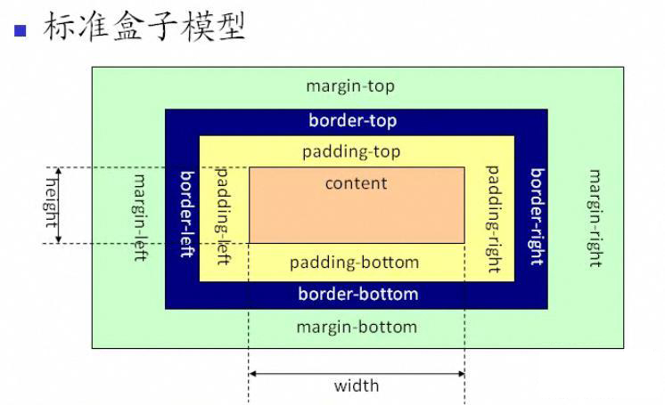
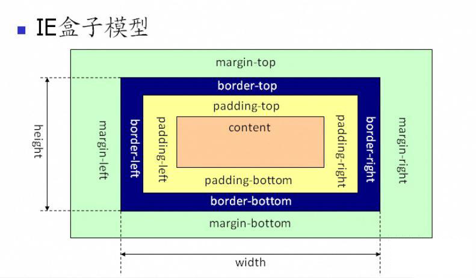

# Casading Style Sheets
```css
选择器{属性:值};
selector{property:value};
```
注释方法  /* ...*/  
## 创建方式
### 1.外部样式表
应用于当样式需要在很多页面时
```html
<head>
<link rel="stylesheet" type="text/css" href="mystyle.css">
</head>
```
### 2.内部样式表
当单个文档需特殊的样式时使用,使用`<style>`标签在文档头部定义
### 3.内联样式
当样式仅需在一个元素上应用一次时使用
### 4.多重样式
元素会继承上级定义的样式,但重复的样式会被优先级更高的覆盖  
权重计算:

| 内联样式表 | ID选择器 | Class类选择器 | HTML标签选择器 |
| --------- | ------- | ------------ | ------------- |
| 1000      | 100     | 10           | 1             |

```
当!important规则被应用在一个样式说明中,该样式会覆盖CSS中任何其他声明,与优先级无关
```
权重进行比较时,并不是权值的数值总和大小进行比较,而是从高到低逐级将等级位上的权重值进行比较,若各等级都相同,则采用后者覆盖
```html
如两个选择器
#parent p{background:red;}
div .a.b.c.d.e.f.g.h.i.j.k p{background:yellow;}
第一个的权重为 0 100 1 0
第二个的权重为 0 0 10*11 1*2
尽管第一个权值为101,第二个权值为112,但由于第一个有ID选择器,因此还是第一个的样式更优先
```
## 选择器
1. id选择器
2. class选择器
## Background

|         属性          |                                               定义                                               |
| --------------------- | ----------------------------------------------------------------------------------------------- |
| background-color      | 定义元素背景颜色,可采用十六进制,RGB,颜色名                                                          |
| background-image      | 定义元素背景图像,`body{background-image:url('');`                                                 |
| background-repeat     | 对背景图像进行平铺,默认为在水平或垂直方向平铺.`background-repeat:repeat-x;background-repeat:no-repeat`     |
| background-position   | 改变图像在背景中的位置<br>1. 关键字:top,bottom,left,right,center.采用两个关键字,一个水平方向,一个垂直方向,若只有一个关键字,则默认另一个为center<br>2. 百分数值: 第一个水平,第二个垂直<br>3. 长度值:元素内边距左上角的偏移距离 |
| background-attachment | 设置背景图像是否固定或随页面其余部分滚动<br>background-attachment:fixed;固定<br>background-attachment:scroll;随滚动(默认)<br>background-attachment:inherit;随父元素继承设置<br>background-attachment:local;背景图片随滚动元素滚动         |

当实际书写时建议以上简写为 background属性,无硬性要求属性顺序,推荐color->image->repeat->attachment->position,如:
```css
body{background:red url("a.jpg") no-repeat fixed center}
```
## Text

|      属性       |                                                               定义                                                               |
| --------------- | ------------------------------------------------------------------------------------------------------------------------------- |
| color           | 设置文字颜色                                                                                                                     |
| text-align      | 文字排列属性,用于设置文本水平对齐方法.有right,left(默认),center,justify(两端对齐,左右外边框对齐),inherit                              |
| text-decoration | 设置或删除文本的装饰.有none,underline,overline,line-through,blink,inherit;                                                        |
| text-transform  | 指定在一个文本中的大写小写字母.有capitalize(首字母大写),uppercase(都大写),lowercase(都小写),none(默认,正常),inherit                   |
| text-indent     | 文本缩进,用于指定文本的第一行缩进.数字值(默认0),百分比(基于父元素宽度的百分比缩进),herit.                                              |
| word-spacing    | 改变字之间的标准间隔.length,normal(默认),inherit                                                                                         |
| direction       | 设置文字方向.rtl(从右到左),ltr(默认),inherit                                                                                      |
| letter-spacing  | 增加或减少字符间的间距.normal(默认),2px,-3px;                                                                                      |
| line-height     | 设置行高.normal(默认),number(与当前字体尺寸相乘来设置行间距),length(固定的行间距),百分比(基于当前字体百分比的行间距),inherit            |
| text-shadow     | 设置文本阴影.<br>`text-shadow:h-shadow v-shadow blur color;` <br>水平阴影位置(必选) 垂直阴影位置(必选) 模糊距离 颜色                 |
| unicode-bid     | 设置会返回文本是否被重写.一般与direction连用.`style:"direction:rtl;unicode-bidi:bidi-override;`可以使中文字符从右到左                |
| vertical-align  | 设置元素的垂直对齐.<br>basement(默认,放置于父元素基线上)<br>sub(垂直对齐文本下标)<br>super(垂直对齐文本上标)<br>top(元素顶端与行中最高元素的顶端对齐<br>text-top(元素顶端与父元素字体的顶端对齐)<br>text-bottom(元素底端与父元素字体底端对齐)<br>middle(放置于父元素中部)<br>bottom(元素顶端与行中最低元素的顶端对齐) |
| white-space     | 设置元素中空白的处理方式.<br>white-space:normal(默认,空白被浏览器忽略)<br>pre(空白被保留,类似于`<pre>`标签)<br>nowrap(文本不换行,会在同一行上继续,直到遇到`<br>`<br>pre-wrap(保留空白符序列,但正常换行)<br>pre-line(合并空白符序列,但保留换行符)<br>inherit   |

## Fonts

| Generic family |          字体系列           |           说明           |
| -------------- | -------------------------- | ------------------------ |
| Serif          | Times New Roman Georgia    | 字符在行的末端有额外的装饰 |
| Sans-Serif     | Arial Verdana              | 字符在行的末端无额外的装饰 |
| Monospace      | Courier New Lucida Console | 所有等宽字符有相同宽度     |

|     属性     |                                               定义                                               |
| ------------ | ------------------------------------------------------------------------------------------------ |
| font-family  | 设置文本字体系列.`字体系列名称超过一个字需要引号`应设置多个字体名称作为后备                            |
| font-style   | 用于指定文字样式.<br>normal(默认)<br>italic(对每个字母结构有小改动)<br>oblique(正常竖直文本的倾斜版本) |
| font-size    | 设置文本大小.xx-small至xx-large,smaller、larger(与父元素想比),length,百分比,inherit                 |
| font-weight  | 设置字体粗细.normal,bold,bolder,lighter,100-900(400=normal,700=bold),inherit                      |
| font-variant | 以小型大写字体或正常字体显示文本,即所有字母变大写但与其余文本比较,尺寸更小.normal,small-caps,inherit    |

1. 为避免IE中无法调整文本的问题,使用em单位代替像素,1em与当前字体大小相等.
2. 实际建议简写为font属性,按**font-style ->font-variant ->font-weight ->font-size ->font-family** 顺序;

## 链接

|  链接状态  |                   |
| --------- | ----------------- |
| a:link    | 正常,未访问过的链接 |
| a:visited | 用户已访问过的链接  |
| a:hover   | 用户鼠标放在链接上  |
| a:active  | 链接被点击的那一刻  |

## 列表样式

|        属性         |                                             定义                                              |
| ------------------- | -------------------------------------------------------------------------------------------- |
| list-style-type     | 指定列表项标记类型.有none,disc(实心圆),circle(空心圆),square(实心方块),demical(阿拉伯数字),lower-alpha(小写英文字母),upper-alpha(大写),lower-roman(小写罗马数字),upper-roman(大写) |
| list-style-image    | 指定列表中列表项标记的图像. `url('a.gif')`,normal,inherit                                       |
| list-style-position | 确定标志出现在列表项内容之外或内部.inside,outside                                                |

简写为list-style属性,简写顺序为 **list-style-type -> list-style-position -> list-style-image**

## 表格

|      属性       |                              定义                               |
| --------------- | --------------------------------------------------------------- |
| border          | 指定表格边框                                                     |
| border-collapse | 设置表格的边框是否被折叠成一个单一的边框.`border-collapse:collapse` |
| padding         | 在表中的内容中控制空格之间的边框                                   |

## 盒子模型
1. 标准盒子模型

2. IE盒子模型
  
```
IE盒子模型里,content包含了border和padding,更有利于开发
```

|         |                    定义                    |
| ------- | ------------------------------------------ |
| Margin  | 外边框.边框区域,无背景颜色,完全透明           |
| Border  | 边框.边框周围的填充与内容,受盒子的背景颜色影响 |
| Padding | 内边距.内容周围的区域,受框中填充的背景颜色影响 |
| Content | 内容.盒子内容,显示图像与文本                 |

### Margin(外边框)
定义元素周围的空间,接受长度单位,百分值或负数.

### Border(边框)
|              |                                                   定义                                                    |
| ------------ | -------------------------------------------------------------------------------------------------------- |
| border-width | 为边框指定宽度.em或px,或thin,medium,thick                                                                  |
| border-style | 用于定义边框的样式.<br>none,默认无边框.<br>dotted,点线框.<br>dashed,虚线框.<br>solid,实线边界.<br>double,两个边界,宽度与border-width相同.<br>groove,3D沟槽边界,效果取决于边界颜色值.<br>ridge,3D脊边界,效果同上.<br>inset,3D嵌入边框,效果同上.<br>outset,3D突出边框,效果同上. |
| border-color | `border-color:transparent;` 透明样式                                                                                                        |

使用border属性简写,顺序按 **border-width -> border-style -> border-color**.

### Outline(轮廓)
1. 为绘制于元素周围的一条线,位于边框边缘的外围,可起到突出元素的作用
2. 指定样式、颜色和外边框的宽度
3. 其位置使其不像边框那样参与到文档流中,因此其出现与消失不会影响文档流(**即不占位置**)
4. 其属性与Border相同

### Padding(内边距)
定义元素边框与元素内容间的空间

### box-sizing
|     值      |             定义              |
| ----------- | ----------------------------- |
| content-box | 默认,宽度和高度分别应用到元素的内容框,在高度和宽度之外绘制元素的内边距和边框. |
| border-box  | 为元素设定的高度和宽度决定了元素的边框盒子.    |
## Dimension(尺寸)
1. height
2. width
3. line-height
4. max-height
5. max-width
6. min-height
7. min-width

## Display Visibility
1. display属性 设置一个元素应如何显示
2. visibility属性 指定一个元素应可见还是隐藏
```css
用于隐藏元素
display:none;  <-- 隐藏元素但不会占用空间
visibility:hidden;  <-- 隐藏元素但仍需占用与隐藏前一样的空间
```
将内联元素转换为块元素:
```css
display:block;   //块元素  占用全部宽度,前后都是换行符,如<p>,<h1>,<div>
```
将块元素转换为内联元素
```css
display:inline;  //内联元素,只需要必要宽度,不强制换行,如<span><a>
```
*visibility:collapse; <-- 用于在表格中删除行列(但还是会占用空间)*

## Positioning(定位)
4种定位方法

| Positioning: |                                                   定义                                                    |
| ------------ | -------------------------------------------------------------------------------------------------------- |
| static       | 默认值,即无定位,元素出现在正常的流中,静态元素不受top,bottom,left,right影响                                    |
| fixed        | **元素位置相对于浏览器窗口固定**,窗口滚动其位置不会滚动,与文档流无关,**不占据空间**,与其他元素重叠             |
| relative     | 相对定位元素的定位**相对其正常位置**,可能会造成元素重叠.但即使元素移动了,其所占空间仍存在.                      |
| absolute     | 绝对定位的元素相对于**最近的已定位的父元素**,若元素无已定位的父元素,则其位置相对于`<html>`,不占据空间,与其他元素重叠 |
| z-index      | 指定一个元素的堆叠顺序.`z-index:数字;`,数字越大,置于越前.若两重叠元素没设置z-index,**最后定位**在HTML代码中的元素置于最前  |

|          |                                                     定义                                                     |
| -------- | ------------------------------------------------------------------------------------------------------------ |
| clip     | 剪辑一个绝对定位的元素.auto(默认);<br>clip:rect(top,right,bottom,left); <--唯一合法形状值                        |
| overflow | 设置当元素溢出其区域时发生的事.<br>visible;默认,内容不被修剪,溢出内容呈现在元素框之外;<br>hidden;元素被修剪,且其余内容不可见;<br>scroll;内容被修剪,但浏览器显示滚动条;<br>auto;若内容被修剪,则显示滚动条;<br>inherit; |
| cursor   | 定义了鼠标指针放在一个元素边界范围内时所用的光标形状;                                                             |

## Float
定义元素往哪个方向浮动,浮动元素会生成一个块级框,直至该块级框的外边缘碰到包含框或其他的浮动框为止.  
1.  `float：right；`浮动元素之后的元素将围绕它,之前的元素不受影响
2. `clear:right;`清楚元素右侧的浮动;

## Horizontal Align(水平对齐)
[css水平垂直居中.md](file:///E:/前端知识整理/css/css水平垂直居中.md)

## 选择符
|                         |                             定义                              |
| ----------------------- | ------------------------------------------------------------- |
| `*`                     | 全选页面上的所有元素                                            |
| `#X`                    | 用id定位某元素                                                 |
| `.X`                    | class选择器                                                   |
| `X Y`                   | 后代选择器,匹配所有X元素的后代Y元素                              |
| `X`                     | 类型选择器,定位页面上所有X标签                                  |
| `X:visited X:link`      | 定位未(已)被访问过的链接                                        |
| `X+Y`                   | 相邻兄弟选择器,匹配与X相邻的Y                                |
| `X>Y`                   | 子元素选择器,选择X的子元素Y                                     |
| `X~Y`                   | 普通兄弟选择器,选择X的所有兄弟元素Y                              |
| `X[title]`              | 属性选择器,选择包含属性title的X元素                             |
| `X[href="fof"]`         | 选择将href属性设置为fof的X元素                                  |
| `X[href*="foo"]`        | 选择href属性内带foo字符的X元素                                  |
| `X[href^="foo"]`        | 选择href属性中以foo开头的X元素                                  |
| `X[href$="foo"]`        | 选择href属性中以foo结尾的X元素                                  |
| `X[data-*="foo"]`       | 选择具有`data-*="foo"`属性的元素(*可自定义)                     |
| `X[foo~="bar"]`         | 选择属性值被空格分隔符分开的值,如`<p foo="bar ha hahaha">啊</p>` |
| `X:checked`             | 定位被选中的单选框与多选框                                      |
| `X:after`               | 定位X元素的后面                                                |
| `X:hover`               | 定位鼠标移动到X元素上时                                         |
| `X:not(selector)`       | 取反                                                          |
| `X::pseduoElement`      | 伪元素选择器,如`p::first-letter`;`p::first-line`;               |
| `X:nth-child(n)`        | 获取X的第n个元素                                               |
| `X:nth-last-child(n)`   | 从结尾处倒数取标签                                              |
| `X:nth-of-type(n)`      | 第n个X标签                                                     |
| `X:nth-last-of-type(n)` | 从结尾处倒数取标签                                              |
| `X:first-child`         | X的第一个子标签                                                |
| `X:last-child`          | X的最后一个子标签                                              |
| `X:only-child`          | `div p:only-child{}`只有一个p段落标签的div                      |
| `X:only-of-type`        | 只有一个子标签的X标签                                           |
| `X:first-of-type`       | 指定匹配元素其父级是特定类型的第一个子元素,与`:nth-of-type(1)`一样    |

## Pseudo-classes(伪类)
用于添加一些选择器的特殊效果.当元素达到一个特定状态时,它可能得到一个伪类的样式,当状态改变时,它又会失去这个样式.   
如`a:link a:visited a:hover a:active`既是伪类,还有如`:first-child`;`:focus`;`:first-letter`;`:first-line`;`:before`;`:after`.

## opacity(透明度)
`opacity`  :   透明度,值在0~1之间,越小则越透明;  
可以制作悬停效果:

```css
img{
opacity:0.4;
filter:alpha(opacity=40); //IE8及更早使用
}
img:hover{
opacity:1.0;
}
```

## 媒体查询
`@media` 规则

|  媒体类型   |         描述         |
| ---------- | ------------------- |
| all        | 用于所有媒体设备      |
| print      | 用于打印机           |
| projection | 用于方案展示,如幻灯片 |
| screen     | 用于电脑显示器       |

```css
@media screen and (max-width:500px){}
```