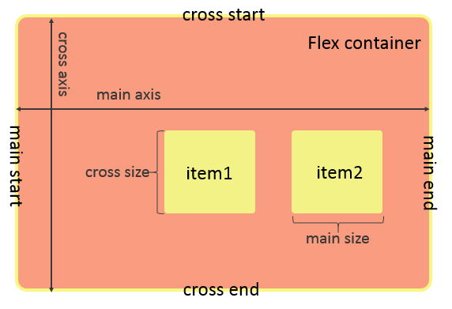

# Flex布局使用
任何一个容器都可以指定为flex布局
```css
.box{
  display:flex;
}
```
行内元素也可以使用flex布局
```css
.box{
  display:inline-flex;
  }
```
对于使用webkit内核的浏览器,必须加上-webkit前缀
```css
.box{
  display:-webkit-flex;  /*Safari */
  display:flex;
```
# Flex概念图
  
# 容器属性
|     属性名      |                        定义                         |
| --------------- | -------------------------------------------------- |
| flex-direction  | 决定主轴的方向.<br>`row` 主轴为水平,从左往右;<br>`column`主轴为竖直方向,从上往下;<br>`row-reverse` 从右到左;<br>`column-reverse`            |
| flex-wrap       | 决定当排列不下时是否换行及换行的方式.<br>`nowrap`,默认,自动缩小项目,不换行;<br>`wrap`,换行,且第一行在上方;<br>`wrap-reverse`,换行,且第一行在下面   |
| flex-flow       | flex-direction与flex-wrap的简写,默认row,nowrap      |
| justify-content | 决定item在主轴上的对齐方式.<br>`flex-start`,默认,左对齐;<br>`flex-end`,右对齐;<br>`center`,居中;<br>`space-between`,两端对齐;<br>`space-around`,沿轴线均匀分布     |
| align-items     | 决定items在交叉轴上的对齐方式.<br>`flex-start`,顶端对齐;<br>`flex-end`,底部对齐;<br>`center`,竖直方向上居中对齐;<br>`baseline`,item第一行文字的底部对齐;<br>`stretch`,当item未设置高度时,item将和容器等高对齐   |
| align-content   | 当有多根主轴,即item不知一行时,多行在交叉轴上的对齐方式.(多行定义了align-content后align-items属性失效.<br>`flex-start`;<br>`flex-end`;<br>`center`;<br>`space-between`;<br>`space-around`;<br>`stretch`;                                            |

# flex items属性
|    属性     |                          定义                           |
| ----------- | ------------------------------------------------------ |
| order       | 为整数,默认0,越小,item排列越靠前                          |
| flex-grow   | 当flex容器有多余空间时,item是否放大,默认0,按比例放大       |
| flex-shrink | 当容器空间不足,item是否缩小,默认1,表示当空间不足时,将自动缩小,为整数,表示不同item的缩小比例 |
| flex-basis  | 表示item在主轴上占据的空间,默认auto                                                       |
| flex        | 为flex-grow,flex-shrink,flex-basis的简写                                                       |
| align-self  | 允许item有自己独特的在交叉轴上的对齐方法.<br>`auto`,和父元素align-self值一致;<br>`flex-start`;`flex-end`;`center`;`baseline`;`stretch`;                                                       |
