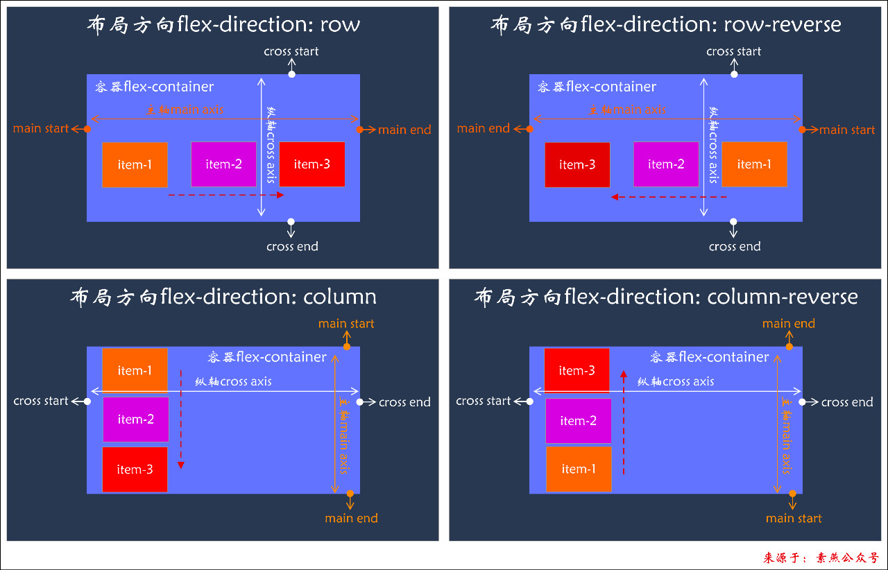

# Flex布局使用

任何一个容器都可以指定为flex布局
```css
.box{
  display:flex;
}
```
行内元素也可以使用flex布局
```css
.box{
  display:inline-flex;
  }
```
对于使用webkit内核的浏览器,必须加上-webkit前缀
```css
.box{
  display:-webkit-flex;  /*Safari */
  display:flex;
```
# Flex概念图

 

# Flex属性整理

+ 容器属性(`display:flex`)
  1. `align-content`：flex-start | flex-end | center | space-between | space-around | space evenly
  2. `align-items`：flex-start | flex-end | baseline | stretch
  3. `flex-flow`：
     1. `flex-direction`：row | row-reverse | column | column-reverse
     2. `flex-wrap`：nowarp | warp | wrap-reverse
  4. `justify-content`：flex-start | flex-end | center | space-between | space-around | space-evenly
+ item属性
  1. `align-self`
  2. `flex`：
     1. `flex-basic`
     2. `flex-grow`
     3. `flex-shrink`
  3. `order`


# 关键点

1. 主轴`main axis`是指由`flex-direction`控制的`flex-item`的布局方向，并不一定是水平的

2. 纵轴`cross axis`是与主轴成垂直相交关系的轴，并不一定是垂直的

3. `justify-content`控制的是`flex-item`在主轴上的对齐方式

4. `justify-content:around`意思是左右间距是中间间距的二分之一；

   `justify-content:evenly`意思是左右间距和中间间距相等

   `justify-content:space-between`意思是左右无间距

5. `align-items`控制的是`flex-item`在纵轴上的对齐方式

6. `align-content`控制的是多行情况下`flex-item`的行间距在纵轴的对齐方式

7. `flex`内容对应`flex-grow`、`flex-shrink`、`flex-basis`

   1. `flex:initial`===`flex:0 1 auto`
   2. `flex:auto`===`flex:1 1 auto`
   3. `flex:none`===`flex:0 0 auto`
   4. `flex:1`===`flex:1 1 0`

8. `flex-basis`的优先级关系：

   1. `content-size`控制的最大最小宽高优先级最高
   2. `flex-basis`会覆盖`width`的值

9. `flex-grow`和`flex-shrink`的计算关系：

   basis：flex-basis的值

   freeSpace：flex container的宽度减去所有item的flex-basis的值，可负

   

   gWidth：添加扩展空间后的宽度

   grow：flex-grow的值

   sumGrow：flex-grow*1* + ... + flex-grow*n*

   

   sWidth：减去收缩空间后的宽度

   shrink：flex-shrink的值

   sumShrink：flex-shrink*1*+ ... + flex-shrink*n*

   

   1. `flex-grow`且`sumGrow>=1`
      $$
      gWdith = basis+freeSpace*\frac{grow}{grow1+....+grown}
      $$

   2. `flex-grow`且`sumGrow<1`
      $$
      gWdith = basis+freeSpace*\frac{grow}{grow1+....+grown}*sumGrow
      $$
      
3. `flex-shrink`且`sumShrink>=1`
      $$
      sWidth = basis+freeSpace*\frac{basis*shrink}{basis1*shrink1+...+basisn*shrinn}
      $$
      
   4. `flex-shrink`且`sumShrink<1`
   $$
      sWidth = basis+freeSpace*\frac{basis*shrink}{basis1*shrink1+...+basisn*shrinn}*sumShrink
      $$
   
   例子：

   ```html
<div class="box">
        <div></div>
        <div></div>
        <div></div>
   </div
   ```
   
   ```css
.box {
       display: flex;
       width: 800px;
       height: 100px;
       background-color: hotpink;
   }
   div div {
       height: 60px;
   }
   div div:nth-child(1) {
       background-color: antiquewhite;
       width: 200px;
       flex-shrink:1;
   }
   div div:nth-child(2) {
       background-color: red;
       width: 300px;
       flex-shrink:2
   }
   div div:nth-child(3) {
       background-color: green;
       width: 400px;
       flex-shrink:3
   }
   ```
   
   计算过程：

   freeSpace = 800 - （200 + 300 + 400）= -100；

   sum = 200\*1 + 300\*2 + 400*3 = 2000;

   item0 = 200 + (-100)*(200\*1)/ sum = 200-10=190;

   item1 = 300 + (-100)*(300\*2)/ sum = 300-30=270;

   item2 = 400 + (-100)*(400\*3)/ sum = 400-60=340;

   

   但若是flex-shrink之和<1，那么item还是会超出容器

   同理若是flex-grow之和>1，那么item会有剩余，无法撑满整个容器

   上述例子改为:

   ```css
div div:nth-child(1) {
       background-color: antiquewhite;
       flex-shrink: 0.1;
       width: 200px;
   }
   div div:nth-child(2) {
       background-color: red;
       flex-shrink: 0.2;
       width: 300px;
   }
   div div:nth-child(3) {
       background-color: green;
       flex-shrink: 0.3;
       width: 400px;
   }
   ```
   
   计算过程：

   space = 800 - （200 + 300 + 400）= -100；

   sum = 0.1 + 0.2 + 0.3 = 0.6;

   factor1 = 0.1 * 200 = 20;
factor2 = 0.2 * 300 = 60;
   factor3 = 0.3 * 400 = 120;
   
   sumFactor = 20 + 60 + 120 = 200;

   ratio1 = factor1 / 200 = 20 / 200 = 1/10;
ratio2 = factor3 / 300 = 60 / 200 = 3/10;
   ratio3 = factor3 / 400 = 120 / 200 = 6/10;
   
   item1 = 200 + (-100) * 0.6 * 1/10 = 200-6 = 194;

   item2 = 300 + (-100) * 0.6 * 3/10 = 300-18 = 282;

   item3 = 400 + (-100) * 0.6 * 6/10 = 400-36 = 364;


