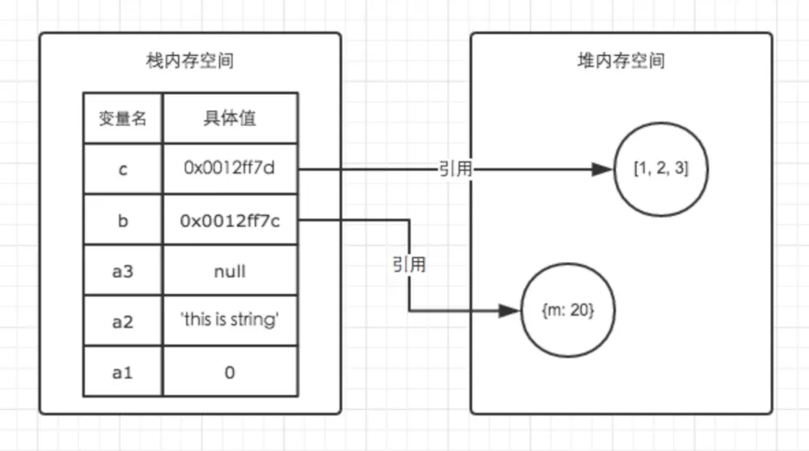

# 数据类型

包含有 undefined String Boolean Number Object Symbol(ES6新添加)  
但还可以细分为基本类型和引用类型
## 基本类型和引用类型
1. 基本类型:Number Boolean String undefined null
2. 引用类型:Object Array Function Data等
## 栈内存(stock)和堆内存(heap)
在JS中，每一个数据都需要一个内存空间。内存空间又被分为两种：1. 栈内存 2. 堆内存  
1. JS中的基础数据类型,又称原始数据类型,值又固定的大小,往往保存在**栈内存**中,由系统自动分配存储空间.我们可以直接操作保存在**栈内存**空间的值，因此基础数据类型都是按值访问。也就是说，它们的值直接存储在变量访问的位置.  
数据在栈内存中的存储与使用方式类似于数据结构中的堆栈数据结构，遵循后进先出的原则.如羽毛球筒.  
2. 引用数据类型的值是保存在**堆内存**中的对象.  
JavaScript不允许直接访问堆内存中的位置，因此我们不能直接操作对象的堆内存空间。在操作对象时，实际上是在操作对象的引用而不是实际的对象。因此，引用类型的值都是按引用访问的。这里的引用，我们可以粗浅地理解为保存在栈内存中的一个地址，该地址与堆内存的实际值相关联。为了更好的搞懂栈内存与堆内存，我们可以结合以下例子与图解进行理解。

```JavaScript
var a1 = 0;   // 栈
var a2 = 'this is string'; // 栈
var a3 = null; // 栈

var b = { m: 20 }; // 变量b存在于栈中，{m: 20} 作为对象存在于堆内存中
var c = [1, 2, 3]; // 变量c存在于栈中，[1, 2, 3] 作为对象存在于堆内存中
```
  
## 基本类型和引用类型的特点
1. 例一:

```JavaScript
let a = 20;
let b = a;
b = 30;
console.log(a) // 这时a的值是20
```
  
在栈内存中的数据发生复制行为时，系统会自动为新的变量分配一个新的内存空间。上例中 let b = a 执行之后，a与b虽然值都等于20，但是他们其实已经是相互独立互不影响的值了。具体如图。所以我们修改了b的值以后，a的值并不会发生变化。因此输出的 a 的值还是 20。

2. 例二:

```JavaScript
let m = { a: 10, b: 20 }
let n = m;
n.a = 15;
console.log(m.a) // 这时m.a的值是15
```
  
我们通过let n = m 执行一次复制引用类型的操作。引用类型的复制同样也会为新的变量自动分配一个新的值保存在栈内存中，但不同的是，这个新的值，仅仅只是引用类型存在栈内存中的一个地址指针。当地址指针相同时，尽管他们相互独立，但是在堆内存中访问到的具体对象实际上是同一个。如图所示。因此当我改变n时，m也发生了变化。此时输出的m.a的值也变成了15，这就是引用类型的特性。

## JavaScript浅克隆和深度克隆
### 浅克隆
对象只会被克隆最外部的一层,至于更深层的对象,则依然是通过引用指向同一块堆内存.

```JavaScript
// 浅克隆函数
function shallowClone(o) {
  const obj = {};
  for ( let i in o) {     //遍历o中的属性
    obj[i] = o[i];
  }
  return obj;
}
// 被克隆对象
const oldObj = {
  a: 1,
  b: [ 'e', 'f', 'g' ],
  c: { h: { i: 2 } }
};

const newObj = shallowClone(oldObj);
console.log(newObj.c.h, oldObj.c.h); // { i: 2 } { i: 2 }
console.log(oldObj.c.h === newObj.c.h); // true
newObj.c.h.i = '我们两个都变了';
console.log(newObj.c.h, oldObj.c.h); // { i: '我们两个都变了' } { i: '我们两个都变了' }
```
虽然`oldObj.c.h`被克隆了,但是它还与`oldObj.c.h`相等,这表明他们依然指向同一段堆内存,我们上面讨论过了引用类型的特点，这就造成了如果对`newObj.c.h`进行修改,也会影响`oldObj.c.h`.

### 深克隆
#### 一.JSON.parse方法
JSON对象parse方法可以将JSON字符串反序列化成JS对象，stringify方法可以将JS对象序列化成JSON字符串,
```JavaScript
const oldObj = {
  a: 1,
  b: [ 'e', 'f', 'g' ],
  c: { h: { i: 2 } }
};

const newObj = JSON.parse(JSON.stringify(oldObj)); // 将oldObj先序列化再反序列化。
console.log(newObj.c.h, oldObj.c.h); // { i: 2 } { i: 2 }
console.log(oldObj.c.h === newObj.c.h); // false 这时候就已经不一样了
newObj.c.h.i = '我和oldObj相互独立';
console.log(newObj.c.h, oldObj.c.h); // { i: '我和oldObj相互独立' } { i: 2 }
```
缺点:  
1.他无法实现对函数 、RegExp等特殊对象的克隆;
2.会抛弃对象的constructor,所有的构造函数会指向Object;
3.对象有循环引用,会报错;

```JavaScript
// 构造函数
function person(pname) {
  this.name = pname;
}

const Messi = new person('Messi');

// 函数
function say() {
  console.log('hi');
};

const oldObj = {
  a: say,
  b: new Array(1),
  c: new RegExp('ab+c', 'i'),
  d: Messi
};

const newObj = JSON.parse(JSON.stringify(oldObj));

// 无法复制函数
console.log(newObj.a, oldObj.a); // undefined [Function: say]
// 稀疏数组 复制错误
console.log(newObj.b[0], oldObj.b[0]); // null undefined
// 无法复制正则对象
console.log(newObj.c, oldObj.c); // {} /ab+c/i
// 构造函数指向错误
console.log(newObj.d.constructor, oldObj.d.constructor); // [Function: Object] [Function: person]
```

#### 二:构造一个深度克隆函数
由于要面对不同的对象(正则、数组、Date等)要采用不同的处理方式，我们需要实现一个对象类型判断函数.

```javascript
const isType = (obj, type) => {             //箭头函数
  if (typeof obj !== 'object') return false;
  // 判断数据类型的经典方法：
  const typeString = Object.prototype.toString.call(obj);
  let flag;
  switch (type) {     //switch语句,当type符合case时执行相对应的语句
    case 'Array':
      flag = typeString === '[object Array]';
      break;
    case 'Date':
      flag = typeString === '[object Date]';
      break;
    case 'RegExp':
      flag = typeString === '[object RegExp]';
      break;
    default:
      flag = false;
  }
  return flag;
};
//调试
const arr = Array.of(3, 4, 5, 2);
console.log(isType(arr, 'Array')); // true
```
我们需要通过正则的扩展了解到flags属性等等,因此我们需要实现一个提取flags的函数

```JavaScript
const getRegExp = re => {
  var flags = '';
  if (re.global) flags += 'g';
  if (re.ignoreCase) flags += 'i';
  if (re.multiline) flags += 'm';
  return flags;
};
```
深克隆的实现了.

```JavaScript
/**
* deep clone
* @param  {[type]} parent object 需要进行克隆的对象
* @return {[type]}        深克隆后的对象
*/
const clone = parent => {
  // 维护两个储存循环引用的数组
  const parents = [];
  const children = [];

  const _clone = parent => {
    if (parent === null) return null;
    if (typeof parent !== 'object') return parent;

    let child, proto;

    if (isType(parent, 'Array')) {
      // 对数组做特殊处理
      child = [];
    } else if (isType(parent, 'RegExp')) {
      // 对正则对象做特殊处理
      child = new RegExp(parent.source, getRegExp(parent));
      if (parent.lastIndex) child.lastIndex = parent.lastIndex;
    } else if (isType(parent, 'Date')) {
      // 对Date对象做特殊处理
      child = new Date(parent.getTime());
    } else {
      // 处理对象原型
      proto = Object.getPrototypeOf(parent);
      // 利用Object.create切断原型链
      child = Object.create(proto);
    }

    // 处理循环引用
    const index = parents.indexOf(parent);

    if (index != -1) {
      // 如果父数组存在本对象,说明之前已经被引用过,直接返回此对象
      return children[index];
    }
    parents.push(parent);
    children.push(child);

    for (let i in parent) {
      // 递归
      child[i] = _clone(parent[i]);
    }

    return child;
  };
  return _clone(parent);
};
```
测试:

```JavaScript
function person(pname) {
  this.name = pname;
}

const Messi = new person('Messi');

function say() {
  console.log('hi');
}

const oldObj = {
  a: say,
  c: new RegExp('ab+c', 'i'),
  d: Messi,
};

oldObj.b = oldObj;

const newObj = clone(oldObj);
console.log(newObj.a, oldObj.a); // [Function: say] [Function: say]
console.log(newObj.b, oldObj.b);
// { a: [Function: say], c: /ab+c/i, d: person { name: 'Messi' }, b: [Circular] } { a: [Function: say], c: /ab+c/i, d: person { name: 'Messi' }, b: [Circular] }
console.log(newObj.c, oldObj.c); // /ab+c/i /ab+c/i
console.log(newObj.d.constructor, oldObj.d.constructor);
// [Function: person] [Function: person]
```

#### 三.另一种构造方法

```JavaScript
//深度克隆
function deepClone(obj){
    var result,oClass=isClass(obj);
        //确定result的类型
    if(oClass==="Object"){
        result={};
    }else if(oClass==="Array"){
        result=[];
    }else{
        return obj;
    }
    for(key in obj){
        var copy=obj[key];
        if(isClass(copy)=="Object"){
            result[key]=arguments.callee(copy);//递归调用
        }else if(isClass(copy)=="Array"){
            result[key]=arguments.callee(copy);
        }else{
            result[key]=obj[key];
        }
    }
    return result;
}
//返回传递给他的任意对象的类
function isClass(o){
    if(o===null) return "Null";
    if(o===undefined) return "Undefined";
    return Object.prototype.toString.call(o).slice(8,-1);
}
var oPerson={
    oName:"rookiebob",
    oAge:"18",
    oAddress:{
        province:"beijing"
    },    
    ofavorite:[
        "swimming",
        {reading:"history book"}
    ],
    skill:function(){
        console.log("bob is coding");
    }
};
//深度克隆一个对象
var oNew=deepClone(oPerson);
 
oNew.ofavorite[1].reading="picture";
console.log(oNew.ofavorite[1].reading);//picture
console.log(oPerson.ofavorite[1].reading);//history book
 
oNew.oAddress.province="shanghai";
console.log(oPerson.oAddress.province);//beijing
console.log(oNew.oAddress.province);//shanghai
```