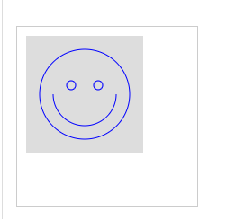
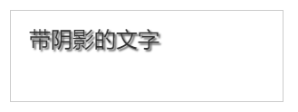

[TOC]

# 浏览器对象（BOM）

## `window`

充当全局作用域，且表示浏览器窗口

内含`innerWidth`与`innerHeight`属性，获取浏览器窗口的内部宽度和高度(指网页的净宽高，不含菜单栏、工具栏、边框等)

还有`outerWidth`与`outerHeight`属性，获取浏览器窗口的整个宽高

## `navigator`

表示浏览器的信息，常用的有：

- `navigator.appName`：浏览器名称；
- `navigator.appVersion`：浏览器版本；
- `navigator.language`：浏览器设置的语言；
- `navigator.platform`：操作系统类型；
- `navigator.userAgent`：浏览器设定的`User-Agent`字符串。

> `navigator`信息很容易可以被用户篡改，因而读取值不一定准确

-----------

针对不同浏览器编写不同的代码：

```javascript
var width = window.innerWidth || document.body.clientWidth;
```

## `screen`

表示屏幕的信息，常用的有：

- `screen.width`：屏幕宽度，以像素为单位；
- `screen.height`：屏幕高度，以像素为单位；
- `screen.colorDepth`：返回颜色位数，如8、16、24。

## `location`

表示当前页面的URL信息：

```javascript
//使用location.href获取完整的URL：
location.href; //http://www.example.com:8080/path/index.html?a=1&b=2#TOP

//获取指定部分的值：
location.protocol; // 'http'
location.host; // 'www.example.com'
location.port; // '8080'
location.pathname; // '/path/index.html'
location.search; // '?a=1&b=2'
location.hash; // 'TOP'

//加载新页面：
location.assign('');

//重新加载当前页面：
location.reload();
```

## `document`

表示当前页面，作为整个DOM树的根节点

`.getElementByID()`

`.getElementsByTagName()`

`.cookie()`

## `history`

保存浏览器的历史记录，

`back()`相当于后退按钮

`forward()`相当于前进按钮

==最好别用这个对象==

# 操作DOM

1. 定位DOM节点方法一：

   `document.getElementById()`

   `document.getElementsByTagName()`

   `document.getElementsByClassName()`

   `document.getElementsByNmae()`

2. 方法二：

   `querySelector()`

   `querySelectorAll()`

   ```javascript
   // 通过querySelector获取ID为q1的节点：
   var q1 = document.querySelector('#q1');
   
   // 通过querySelectorAll获取q1节点内的符合条件的所有节点：
   var ps = q1.querySelectorAll('div.highlighted > p');
   ```

   > 低版本的IE<8不支持，IE8有限支持

## 更新DOM

1. `innerHTML`

可以用于修改DOM节点的文本内容，还可以直接通过HTML片段修改DOM节点内部的子树：

```javascript
// 获取<p id="p-id">...</p>
var p = document.getElementById('p-id');
// 设置文本为abc:
p.innerHTML = 'ABC'; // <p id="p-id">ABC</p>
// 设置HTML:
p.innerHTML = 'ABC <span style="color:red">RED</span> XYZ';
// <p>...</p>的内部结构已修改
```

2. `innerText`、`textContent`

可以自动对字符串进行HTML编码，但无法设置任何HTML标签：

```javascript
// 获取<p id="p-id">...</p>
var p = document.getElementById('p-id');
// 设置文本:
p.innerText = '<script>alert("Hi")</script>';
// HTML被自动编码，无法设置一个<script>节点:
// <p id="p-id">&lt;script&gt;alert("Hi")&lt;/script&gt;</p>
```

`inerText`不返回隐藏元素的文本，而`textContent`返回所有文本

3. `cssText`

用于修改元素的css值：

```javascript
// 获取<p id="p-id">...</p>
var p = document.getElementById('p-id');
p.style.cssTest = 'color:red ; font-weight:bold;'
//书写时使用css的命名规则
```

## 插入DOM

`appendChild()`：将一个子节点添加到父节点的最后一个子节点

```javascript
<!-- HTML结构 -->
<p id="js">JavaScript</p>
<div id="list">
    <p id="java">Java</p>
    <p id="python">Python</p>
    <p id="scheme">Scheme</p>
</div>

var
    js = document.getElementById('js'),
    list = document.getElementById('list');
//将js节点切换到list中，原js节点删除
list.appendChild(js);

<!-- HTML结构 -->
<div id="list">
    <p id="java">Java</p>
    <p id="python">Python</p>
    <p id="scheme">Scheme</p>
    <p id="js">JavaScript</p>
</div>
```


`insertBefore`：将子节点插入到指定位置

```javascript
<!-- HTML结构 -->
<div id="list">
    <p id="java">Java</p>
    <p id="python">Python</p>
    <p id="scheme">Scheme</p>
</div>

var
    list = document.getElementById('list'),
    ref = document.getElementById('python'),
    haskell = document.createElement('p');
haskell.id = 'haskell';
haskell.innerText = 'Haskell';
list.insertBefore(haskell, ref);

<!-- HTML结构 -->
<div id="list">
    <p id="java">Java</p>
    <p id="haskell">Haskell</p>
    <p id="python">Python</p>
    <p id="scheme">Scheme</p>
</div>
```

## 删除DOM

1. 获取该节点本身和它的父节点
2. 调用父节点的`removeChild()`

```javascript
// 拿到待删除节点:
var self = document.getElementById('to-be-removed');
// 拿到父节点:
var parent = self.parentElement;
// 删除:
var removed = parent.removeChild(self);
removed === self; // true
```

> `children`属性，是一个只读属性，会在子节点变化时实时变化
>
> ```javascript
> <div id="parent">
>     <p>First</p>
>     <p>Second</p>
> </div>
> 
> var parent = document.getElementById('parent');
> parent.removeChild(parent.children[0]);
> parent.removeChild(parent.children[1]); // <-- 浏览器报错
> ```

# 操作表单

表单的输入控件类型：

- 文本框，对应的`<input type="text">`，用于输入文本；
- 口令框，对应的`<input type="password">`，用于输入口令；
- 单选框，对应的`<input type="radio">`，用于选择一项；
- 复选框，对应的`<input type="checkbox">`，用于选择多项；
- 下拉框，对应的`<select>`，用于选择一项；
- 隐藏文本，对应的`<input type="hidden">`，用户不可见，但表单提交时会把隐藏文本发送到服务器。

## 获取值

`value`  用于获得对应的用户输入值

```javascript
// <input type="text" id="email">
var input = document.getElementById('email');
input.value; // '用户输入的值'
```

> 对于单选框和复选框，`value`属性返回的永远是HTML预设的值，而我们需要获得的实际是用户是否“勾上了”选项，所以应该用`checked`判断：

```javascript
// <label><input type="radio" name="weekday" id="monday" value="1"> Monday</label>
// <label><input type="radio" name="weekday" id="tuesday" value="2"> Tuesday</label>
var mon = document.getElementById('monday');
var tue = document.getElementById('tuesday');
mon.value; // '1'
tue.value; // '2'
mon.checked; // true或者false
tue.checked; // true或者false
```

## 设置值

对于`text`、`password`、`hidden`和`select`，可以直接设置`value1`：

```javascript
// <input type="text" id="email">
var input = document.getElementById('email');
input.value = 'test@example.com'; // 文本框的内容已更新
```

对于单选多选框，则设置`checked`：

```javascript
// <label><input type="radio" name="weekday" id="monday" value="1"> Monday</label>
// <label><input type="radio" name="weekday" id="tuesday" value="2"> Tuesday</label>
var mon = document.getElementById('monday');
var tue = document.getElementById('tuesday');
mon.checked = true;
tue.checked = false; 
```

## HTML5控件

新增控件：常用为`data`、`datetime`、`datetime-local`、`color`等

```
<input type="date" value="2015-07-01">
```


```
<input type="datetime-local" value="2015-07-01T02:03:04">
```


```
<input type="color" value="#ff0000">
```


> 若浏览器不支持HTML5，则会将新控件当作`type = 'text'`表示。 

## 提交表单

### 方法一：

通过`<form>`元素的`submit()`方法提交一个表单：

```javascript
//响应一个<button>的click事件

<!-- HTML -->
<form id="test-form">
    <input type="text" name="test">
    <button type="button" onclick="doSubmitForm()">Submit</button>
</form>

<script>
function doSubmitForm() {
    var form = document.getElementById('test-form');
    // 可以在此修改form的input...
    // 提交form:
    form.submit();
}
</script>
```

> 该方法扰乱了浏览器对`<form>`的正常提交。浏览器默认点击`<button type="submit">`时提交表单，或者用户在最后一个输入框按回车键。

### 方法二：

响应`<form>`本身的`onsubmit`事件：

```javascript
<!-- HTML -->
<form id="test-form" onsubmit="return checkForm()">
    <input type="text" name="test">
    <button type="submit">Submit</button>
</form>

<script>
function checkForm() {
    var form = document.getElementById('test-form');
    // 可以在此修改form的input...
    // 继续下一步:
    //此处使用return true来告诉浏览器继续提交，若return false，浏览器不会继续提交form，通常应用与检测用户输入是否有误，有误则提示用户错误信息后终止提交form
    return true;
}
</script>
```

> 在检查和修改`<input>`时，要充分利用`<input type="hidden">`来传递数据。
>
> 例如，很多登录表单希望用户输入用户名和口令，但是，安全考虑，提交表单时不传输明文口令，而是口令的MD5。普通JavaScript开发人员会直接修改`<input>`：
>
> ```javascript
> <!-- HTML -->
> <form id="login-form" method="post" onsubmit="return checkForm()">
>     <input type="text" id="username" name="username">
>     <input type="password" id="password" name="password">
>     <button type="submit">Submit</button>
> </form>
> 
> <script>
> function checkForm() {
>     var pwd = document.getElementById('password');
>     // 把用户输入的明文变为MD5:
>     pwd.value = toMD5(pwd.value);
>     // 继续下一步:
>     return true;
> }
> </script>
> ```
>
> 这个做法看上去没啥问题，但用户输入了口令提交时，口令框的显示会突然从几个`*`变成32个`*`（因为MD5有32个字符）。
>
> 要想不改变用户的输入，可以利用`<input type="hidden">`实现：
>
> ```javascript
> <!-- HTML -->
> <form id="login-form" method="post" onsubmit="return checkForm()">
>     <input type="text" id="username" name="username">
>     <input type="password" id="input-password">
>     <input type="hidden" id="md5-password" name="password">
>     <button type="submit">Submit</button>
> </form>
> 
> <script>
> function checkForm() {
>     var input_pwd = document.getElementById('input-password');
>     var md5_pwd = document.getElementById('md5-password');
>     // 把用户输入的明文变为MD5:
>     md5_pwd.value = toMD5(input_pwd.value);
>     // 继续下一步:
>     return true;
> }
> </script>
> ```
>
> 注意到`id`为`md5-password`的`<input>`标记了`name="password"`，而用户输入的`id`为`input-password`的`<input>`没有`name`属性。==没有`name`属性的`<input>`的数据不会被提交==。

# 操作文件

表单中唯一可上传文件的控件：`<input type = 'file'>`

>当一个表单包含`<input type="file">`时，表单的`enctype`必须指定为`multipart/form-data`，`method`必须指定为`post`，浏览器才能正确编码并以`multipart/form-data`格式发送表单的数据。
>
>出于安全考虑，浏览器只允许用户点击`<input type="file">`来选择本地文件，用JavaScript对`<input type="file">`的`value`赋值是没有任何效果的。当用户选择了上传某个文件后，JavaScript也无法获得该文件的真实路径

上传的文件都由后台服务器处理，JavaScript可以在提交表单时对文件扩展名做检查，以便防止用户上传无效格式的文件：

```javascript
var f = document.getElementById('test-file-upload');
var filename = f.value; // 'C:\fakepath\test.png'
if (!filename || !(filename.endsWith('.jpg') || filename.endsWith('.png') || filename.endsWith('.gif'))) {
    alert('Can only upload image file.');
    return false;
}
```

## File Api   ==HTML5提供==

File Api提供了`File`与`FileReader`两个主要对象，用于获得文件信息并读取文件

```javascript
var
    fileInput = document.getElementById('test-image-file'),
    info = document.getElementById('test-file-info'),
    preview = document.getElementById('test-image-preview');
// 监听change事件:
fileInput.addEventListener('change', function () {
    // 清除背景图片:
    preview.style.backgroundImage = '';
    // 检查文件是否选择:
    if (!fileInput.value) {
        info.innerHTML = '没有选择文件';
        return;
    }
    // 获取File引用:
    var file = fileInput.files[0];
    // 获取File信息:
    info.innerHTML = '文件: ' + file.name + '<br>' +
                     '大小: ' + file.size + '<br>' +
                     '修改: ' + file.lastModifiedDate;
    if (file.type !== 'image/jpeg' && file.type !== 'image/png' && file.type !== 'image/gif') {
        alert('不是有效的图片文件!');
        return;
    }
    // 读取文件:
    var reader = new FileReader();
    //设置回调函数
    reader.onload = function(e) {
        var
            data = e.target.result; // 'data:image/jpeg;base64,/9j/4AAQSk...(base64编码)...'            
        preview.style.backgroundImage = 'url(' + data + ')';
    };
    // 以DataURL的形式读取文件:（异步调用）
    reader.readAsDataURL(file);
    //当FileReader读取文件方式为readAsDataURL之类的时，会触发一个load事件，从而触发上面的onload事件进行处理
});
```

# AJAX

from [廖雪峰的JavaScript教程-浏览器-AJAX](https://www.liaoxuefeng.com/wiki/1022910821149312/1023022332902400)

即Asynchronous JavaScript and XML === 用JavaScript执行异步网络请求

AJAX请求为异步，需要通过回调函数获得响应

> WEB中，一个HTTP请求对应一个页面，当提交表单时，浏览器会刷新页面，在新页面告知操作是否成功。
>
> 若想让用户留在当前页面发出HTTP请求，则需要使用JavaScript来发送并处理，从而达到不用换页面的效果。

现在主要依靠`XMLHttpRequest`对象：

```javascript
function success(text) {
    var textarea = document.getElementById('test-response-text');
    textarea.value = text;
}

function fail(code) {
    var textarea = document.getElementById('test-response-text');
    textarea.value = 'Error code: ' + code;
}

var request = new XMLHttpRequest(); // 新建XMLHttpRequest对象

//对于低版本的IE则需要：
var request new ActiveXObject('Microsoft.XMLHTTP'); //新建Microsoft.XMLHTTP对象

//将标准写法与IE写法混合：
var request;
if (window.XMLHttpRequest){
    request = new XMLHttpRequest();
} else {
    requeset = new ActiveXObject('Microsofe.XMLHTTP');
};


request.onreadystatechange = function () { // 状态发生变化时，函数被回调
    if (request.readyState === 4) { // 成功完成
        // 判断响应结果:
        if (request.status === 200) {
            // 成功，通过responseText拿到响应的文本:
            return success(request.responseText);
        } else {
            // 失败，根据响应码判断失败原因:
            return fail(request.status);
        }
    } else {
        // HTTP请求还在继续...
    }
}

// 调用send()正式发送请求:
request.open('GET', '/api/categories');
request.send();  

alert('请求已发送，请等待响应...');

```

## 安全限制（跨域）

上文代码URL使用相对路径，若使用如`https://www.sina.com/cm/`，再运行，则会报错

默认情况下，JavaScript发送Ajax请求时，URL的域名必须和当前页面完全一致

> 完全一致即：
>
> 1. 域名相同（`www.example.com`与`example.com`不同）
> 2. 协议相同（`http`与`https`不同）
> 3. 端口号相同（默认为`:80`端口，与`:8080`不同）

跨域方法：

1. 通过Flash插件发送HTTP请求，但必须安装Flash且与Flash交互

2. 通过在同源域名下架设一个代理服务器来转发，JavaScript负责把请求发送到代理服务器：

   `/proxy?url=http://www.sina.com.cn`

3. 通过使用JSONP，但有限制，只能用GET请求且要求返回JavaScript：

   先准备好对应的函数，并给页面动态添加一个`<script>`节点，相当于动态读取外域的JavaScript资源，如：

   对于163的股票查询URL，URL：http://api.money.126.net/data/feed/0000001,1399001?callback=refreshPrice，所获得的返回为：

   ```javascript
   refreshPrice({"0000001":{"code": "0000001", ... });
   ```

   因而先准备回调函数：

   ```javascript
   function refreshPrice(data) {
       var p = document.getElementById('test-jsonp');
       p.innerHTML = '当前价格：' +
           data['0000001'].name +': ' + 
           data['0000001'].price + '；' +
           data['1399001'].name + ': ' +
           data['1399001'].price;
   }
   ```

   通过函数触发：

   ```javascript
   function getPrice() {
       var
           js = document.createElement('script'),
           head = document.getElementsByTagName('head')[0];
       js.src = 'http://api.money.126.net/data/feed/0000001,1399001?callback=refreshPrice';
       head.appendChild(js);
   }
   ```

4. 若浏览器支持HTML5，则可以使用新的跨域策略：CORS ==*==

   CORS = Cross-Origin Resource Sharing，为HTML5规范定义的如何跨域访问资源

   ==定义：==

   Origin表示本域，也就是浏览器当前页面的域。当JavaScript向外域（如sina.com）发起请求后，浏览器收到响应后，首先检查`Access-Control-Allow-Origin`是否包含本域，如果是，则此次跨域请求成功，如果不是，则请求失败，JavaScript将无法获取到响应的任何数据。

   用一个图来表示就是：

   

   只要响应头`Access-Control-Allow-Origin`为对应的本域地址或为`*`，即可请求成功

   因此跨域能否成功，取决于对方服务器是否给你设置一个正确的`Access-Control-Allow-Origin`

CORS称为‘简单请求’，包括GET、HEAD、POST


# Canvas ==HTML5==

使用`Canvas`前，使用`canvas.getContext`检测浏览器是否支持：

```html
<canvas id="test-canvas" width="200" heigth="100">
    <p>你的浏览器不支持Canvas</p>
</canvas>
```

```javascript
var canvas = document.getElementById('test-canvas');
if (canvas.getContext) {
    console.log('你的浏览器支持Canvas!');
} else {
    console.log('你的浏览器不支持Canvas!');
}
```

## 获取Canvas对象

获取2d对象：

```javascript
var ctx = canvas.getContext('2d');
```

> 获取一个`CanvasRenderingContext2D`对象

获取3d对象：

```javascript
gl = canvas.getContext("webgl");
```

> HTML5的WebGL规范，用于允许在Canvas中绘制3D图形

## 绘制图案

Canvas中以左上角为原点，水平往右为x，垂直向下为y，以像素为单位，每个点都是非负整数。

```javascript
var
    canvas = document.getElementById('test-shape-canvas'),
    ctx = canvas.getContext('2d');

ctx.clearRect(0, 0, 200, 200); 
// 擦除(0,0)位置大小为200x200的矩形，擦除的意思是把该区域变为透明
ctx.fillStyle = '#dddddd'; 
// 设置颜色
ctx.fillRect(10, 10, 130, 130); 
// 把(10,10)位置大小为130x130的矩形涂色

// 利用Path绘制复杂路径:
//arc()方法用于创建弧/曲线
//arc(x,y,r,sAngle,eAngle,counterclockwise);
//arc(圆心x坐标，圆心y坐标，园半径，起始角（以弧度计，三点钟位置为0度），结束角，false为顺时针，true为逆时针)
var path=new Path2D();
path.arc(75, 75, 50, 0, Math.PI*2, true);
path.moveTo(110,75);
path.arc(75, 75, 35, 0, Math.PI, false);
path.moveTo(65, 65);
path.arc(60, 65, 5, 0, Math.PI*2, true);
path.moveTo(95, 65);
path.arc(90, 65, 5, 0, Math.PI*2, true);
ctx.strokeStyle = '#0000ff';
ctx.stroke(path);
```

效果：



## 绘制文本

与CSS类似：

```javascript
var
    canvas = document.getElementById('test-text-canvas'),
    ctx = canvas.getContext('2d');

ctx.clearRect(0, 0, canvas.width, canvas.height);
ctx.shadowOffsetX = 2;
ctx.shadowOffsetY = 2;
ctx.shadowBlur = 2;
ctx.shadowColor = '#666666';
ctx.font = '24px Arial';
ctx.fillStyle = '#333333';
ctx.fillText('带阴影的文字', 20, 40);
```



