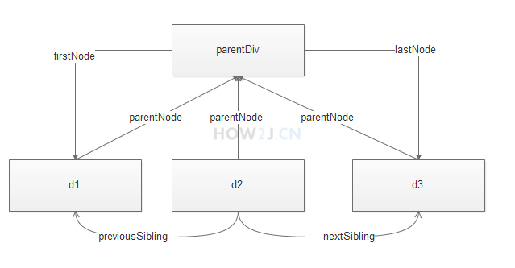

[TOC]

# DOM节点操作

## 创建DOM节点

```JavaScript
var oDiv=document.createElement("div"); //元素节点
var p=document.createTextNode("hello");  //文本节点
var attr=document.createAttribute("style"); //属性节点
```

## 插入DOM节点

```JavaScript
appendChild();
insertBefore(a,b);  //a为插入的新元素,b为插入位置
```

## 删除DOM节点

```JavaScript
removeChild();
removeAttribute();
```

## 查找DOM节点
```JavaScript
getElementById();
getElementsByTagName();
getElementsByClassName();
```

## 替换DOM节点
```JavaScript
//需要先获取父节点,通过父节点替换子节点
replaceChild(a,b);  //用a替代b
```

## 获取设置属性
```JavaScript
getAttribute(); //获取属性
setAttribute(attribute,value);  //设置属性
```

## 查询节点类型

```JavaScript
nodeType;   //元素节点  返回1;属性节点  返回2;文本节点  返回3;
nodeName;   //元素节点  返回标签名;属性节点  返回属性名;
nodeValue;  //用于得到与设置一个节点的值;
	node.nodeValue  //获取
	node.nodeValue=text //设置
```

## DOM节点间关系

```JavaScript
<div id="parentDiv">
 <div id="d1">第一个div</div>
 <div id="d2">第二个div</div>
 <div id="d3">第三个div</div>
</div>
```
  
1. parentNode  用于获取元素的父元素  
2. childNodes   用于获取任何一个元素的所有子元素  
3. firstChild      第一个子元素  
4. lastChild       最后一个子元素  
5. nextSibling   元素的下一个兄弟元素  
6. previousSibling  元素的上一个兄弟元素  
