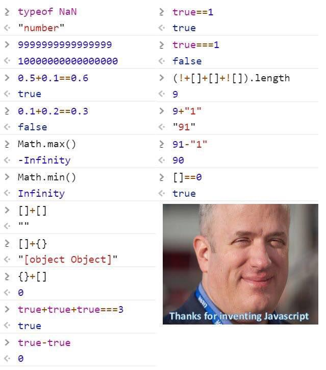

# 0.1+0.2!==0.3

JS遵循二进制浮点数算术标准而有意导致的结果

可以将其*10的倍数变为整数计算后再除以对应倍数来解决


# Math.max()和Math.min()

可以这么理解，`Math.max()`和`Math.min()`内部有一个默认的参数`x`，可以视为：

```javascript
Math.max(a,x);
Math.min(a,x);
```

而要实现求`a`和`x`的最大值/最小值，为了确保逻辑跑通，那么`Math.max`的`x`就是为`-Infinity`了

当参数为空时实际视为`Math.max(-Infinity,-Infinity)`，返回`-Infinity`


# []和{}相加

1. `[]+[]`，加法调用数组的`toString()`，返回`“”`
2. `[]+{}`，同上，`[].toString()==='',{}.toString()==="[object Object]"`
3. `{}+[]`，此时引擎将`{}`视为了一个空的代码块并忽略了他，即式子等于`+[]`，将`[]`转换为数字0


# (!+[]+[]+![]).length===9

1. 第一个`[]`的`+[]`将`[]`转为数字0
2. 第一个`!`配合后面的`!+[]`，逻辑取反，转为布尔值true
3. 第二个`[]`作为加法式子中加数，执行`[].valueOf().toString()===''`
4. 最后一个`![]`，逻辑取反，转为布尔值false
5. 全式等同于`(true+''+false).length===9`


# []==0

`==`下对象先转为`valueOf()`，若还是复杂数据类型继续调用`toString()`

此处`[].valueOf().toString()=== ''`，空字符串

`==`下一方为数值，将另一方转为数值进行比较，`Number('')===0`

