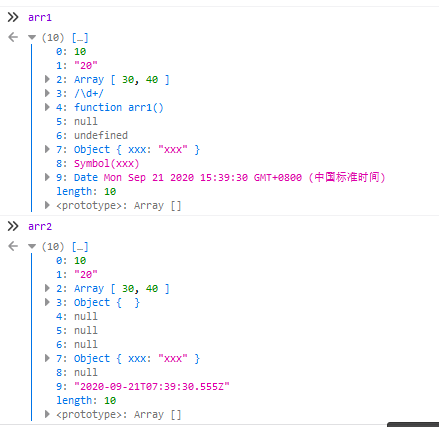

# 浅克隆

```javascript
// 浅克隆函数
function shallowClone(o) {
  const obj = {};
  for ( let i in o) {     //遍历o中的属性
    obj[i] = o[i];
  }
  return obj;
}
// 被克隆对象
const oldObj = {
  a: 1,
  b: [ 'e', 'f', 'g' ],
  c: { h: { i: 2 } }
};

const newObj = shallowClone(oldObj);
console.log(newObj.c.h, oldObj.c.h); // { i: 2 } { i: 2 }
console.log(oldObj.c.h === newObj.c.h); // true
newObj.c.h.i = '我们两个都变了';
console.log(newObj.c.h, oldObj.c.h); // { i: '我们两个都变了' } { i: '我们两个都变了' }
```


# 深克隆

## JSON.parse()

```javascript
const oldObj = {
  a: 1,
  b: [ 'e', 'f', 'g' ],
  c: { h: { i: 2 } }
};

const newObj = JSON.parse(JSON.stringify(oldObj)); // 将oldObj先序列化再反序列化。
console.log(newObj.c.h, oldObj.c.h); // { i: 2 } { i: 2 }
console.log(oldObj.c.h === newObj.c.h); // false 这时候就已经不一样了
newObj.c.h.i = '我和oldObj相互独立';
console.log(newObj.c.h, oldObj.c.h); // { i: '我和oldObj相互独立' } { i: 2 }
```

缺点：

1. 无法克隆函数、RegExp、undefined、symbol值，Date类型会转为字符串
2. 克隆后对象constructor指向Object

```javascript
let arr1 = [10, '20', [30, 40], /\d+/, function () {}, null, undefined, {
    xxx: 'xxx'
}, Symbol('xxx'), new Date()];
```



## 递归

```javascript
function deepClone(target)  {
    if (target === null) return null;
    if (typeof target !== 'object') return target;
    
    //处理特殊对象
    if(target instanceof RegExp)return new RegExp(target);
    if(target instanceof Date)return new Date(target);
    
    //为了保持继承链，或者可以写作：
    //const cloneTarget new target.constructor();
    const cloneTarget = Array.isArray(target) ? [] : {};
    for (let prop in target) {
        if (target.hasOwnProperty(prop)) { 
            // Object.prototype.hasOwnProperty() 方法会返回一个布尔值，指示对象自身属性中是否具有指定的属性（也就是，是否有指定的键）
            cloneTarget[prop] = deepClone(target[prop]);
        }
    }
    return cloneTarget;
}
```

