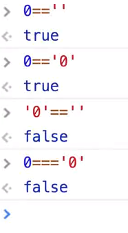
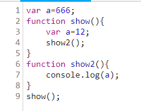

# 面试题

# 数据类型
usbno  
undefined string boolean number object
## js的基本数据类型
undefined boolean number string  
function 是数据类型吗?
# 类型转换
  
 ==存在类型转换 ===必须值相等 且数据类型相等 工作中使用===
# NaN Not a Number
 类型检查  
 isNaN -> ES5 并不靠谱,但ES6修复了  
 NaN 跟谁都不相等,包括其本身  
 typeof NaN = number  
 检测一个变量是否NaN  
 ES6下 isNaN  
 ES5 a!=a(如10!='10') 为false 不是NaN 为true是NaN
# js作用域
推荐使用let 多用let 少用var
## 全局作用域
## 函数作用域
```JavaScript
    for(var i=0;i<5;i++){
    let num=12;
    }
    console.log(num); //undefined
```
## ES6块级作用域
# 所用域链
子函数没有的找父级  父级与该函数在哪里被调用被执行无关,取决于函数被声明时候的父级
  
这种情况输出666,但show2定义放在show()内,则输出12,因为父级不同
# 变量提升 函数预解析
```javascript
console.log(numbers);
var numbers=777;//输出undefined
//相当于
var numbers; //underfined
console.log(numbers);
numbers=777;
```
```javascript
//由于function声明优于var声明,输出 function a (){} 和2
 console.log(a);
  var a = 2;
  function a() {}
  console.log(a);
```
工作使用:可以先写逻辑 再完成函数操作 先 if....  末尾再添加function
# 严格模式
开头加上`"use strict"`
严格模式下,不允许使用未定义的变量,方便检查变量名拼写错误
# IIFE 
即匿名函数自执行  
1.处理变量污染 即变量覆盖
```JavaScript
(function(){
    console.log(566);
})();
//相当于
var show=function(){
    console.log(566);
};
show();
```
# 闭包 closure
```JavaScript
function show(){
    var num=666;
    return function(){
        console.log(num);
    }
}
var show2=show();
show2(); //输出666
//函数内的变量在函数执行完毕之后本应该清除无法被调用,但此处被show内的function调用的现象,称为闭包
```
# 闭包与IIFE
```JavaScript
var arr=[];
for(var i=0;i<3;i++){
    arr[i]=function(){
        return i;
    }
}
console.log(arr[0]()); //3
console.log(arr[1]()); //3
console.log(arr[2]()); //3
//for循环很快就完成了循环,在调用arr[0]之前,i已经变为3
```
```JavaScript
var arr=[];
for(var i=0;i<3;i++){
    (function(num){
        arr[num]=function(){
            return num;
        }
    })(i); //i为实际参数 num为形参
}
console.log(arr[0]()); //0
console.log(arr[1]()); //1
console.log(arr[2]()); //2
//采用闭包 每个循环的i都被function使用,不会被清除
```
```JavaScript
var arr=[];
for(let i=0;i<3;i++){
    arr[i]=function(){
        return i;
    }
}
console.log(arr[0]()); //0
console.log(arr[1]()); //1
console.log(arr[2]()); //2
//不采用var,使用let解决
```
# DOM事件流
  
捕获过程,firefox等公司认为 但IE认为是冒泡过程 W3C两种都支持但默认走冒泡  
高级浏览器下默认冒泡,但两个都支持
# this
1.面试 2.面向对象编程  
 1.全局  
 this 在浏览器下->Window  
 2.函数  
 show(); //Window  
 如果use strict  为undefined  
 3.对象  
 this->指创建的对象  
 ```JavaScript
var teacher={
    name:"kevin",
    showName:function(){
         conosle.log(this);
        }
        testThis();
    }
};
teacher.showName();  //{name:"kevin",showName:f}
 ```
 面试  
 a)严格模式下:
 ```JavaScript
 "use strict"
var teacher={
    name:"kevin",
    showName:function(){
        function testThis(){
            console.log(this);
        }
        testThis();
    }
};
teacher.showName();  //undefined
 ```
b)不加严格模式  
```JavaScript
var name="aaa";
var teacher={
    name:"kevin",
    showName:function(){
        function testThis(){
            console.log(this.name);
        }
        testThis();
    }
};
teacher.showName(); //aaa
//此时this->Window
```
解决: 1.使用let 2.箭头函数 3.bind call apply
# bind call apply
1. call (矫正this,参数1,参数2,参数...)
```JavaScript
    function show(a,b){
        console.log(this,a,b);
    }
    show.call(66,555,5); //Number{66} 555 5
```
```JavaScript
var teacher={
    name:"kevin",
    showName:function(){
        function testThis(){
            console.log(this.name);
        }
        testThis.call(this);
    }
};
teacher.showName();  //kevin
```
2. bind()  不执行,加参数
```JavaScript
var teacher={
    name:"kevin",
    showName:function(){
        var testThis=function(){
            console.log(this.name);
        }.bind(this);
        testThis();
    }
};
teacher.showName();
```
3. apply(this,[]) 与call类似,但参数在数组内
```JavaScript
var arr=[12,5,8];
Math.max.apply(null,arr); //12
```
# js面向对象编程(oo编程)
创建对象三种方式  
1. 单体模式  
 ```JavaScript
 var teacher={
    name:"kevin",
    age:21,
    showName:function(){
        return this.name;
    }
};
teacher.showName();
 ```
 2. 原型模式
    属性放在构造函数里,方法放在原型上
```JavaScript
function Teacher(name,age){
    this.name=name;
    this.age=age;
};
Teacher.prototype.showName=function (){
    return this.name;
};
var kevin=new Teacher('kevin',21);
kevin.showName();
```
3. 伪类模式(类模式)
```javascript
class Teacher{
    constructor(name,age){
        this.name=name;
        this.age=age;
    }
    showName(){
        return this.name;
    }
}
var kevin=new Teacher('kevin',22);
kevin.showName();
```
# 数据交互 跨域
1. JSONP原理
        1.  js是可以跨域的
        2. 服务器返回的数据,show([12,5,8]);
        3. 本地 方法的定义  function show(data){console.log(data)}
        4. JSONP 只能get方式
2. CROS
        1. 必须需要服务器端配合,否则没戏
        2. access-allow